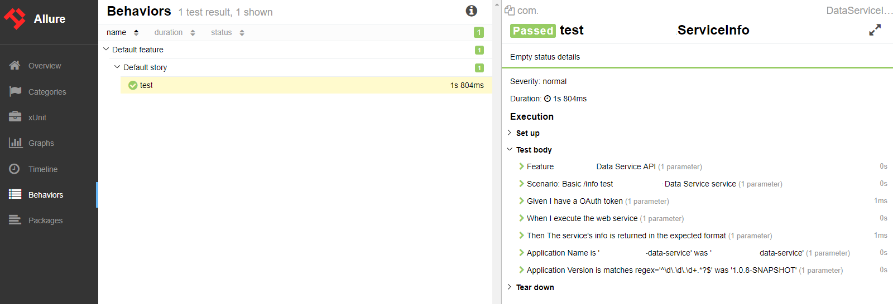

[](https://img.shields.io/maven-central/v/com.pacificwebconsulting.logging/logging-microservice.svg)

[](https://opensource.org/licenses/BSD-3-Clause)

Got a question?  [Email us](http://www.pacificwebconsulting.com/contact/) or reach out on [LinkedIn](https://www.linkedin.com/in/alombardo/) 

# Introduction

Gherkin-Style logger used for automated testing of TestNG-based automation solutions.  This service enables users to 
decorate their TestNG logs with [Behavior Driven Development/Gherkin style](https://code.google.com/p/spectacular/wiki/WritingBDDTests) 
logging.  The service includes static methods to quickly and easily decorate your logs as well as your TestNG Reports.  Furthermore, 
each log message prints the exact timestamp in which an event occurred. 
   
Also, this service automatically formats the all logging message strings and its arguments by ultimately using the String.format() 
capabilities of the String object.  Many of the methods in this API use Java's variable arguments. 

# Questions and issues

The [github issue tracker](https://github.com/AnthonyL22/logging-microservice/issues) is **_only_** for bug reports and 
feature requests. Anything else, such as questions for help in using the library, should be [emailed to our team](http://www.pacificwebconsulting.com/contact/).  

# Prerequisites

1. Java 1.8
2. Maven 3.x

# Maven Dependency

```
<dependency>
    <groupId>com.pacificwebconsulting.logging</groupId>
    <artifactId>logging-microservice</artifactId>
    <version>1.0.x</version>
</dependency>
```

# Integration

Simply, integrate the **LoggerService** service into your project by adding the following static import statement to your class:

```
import static com.pwc.logging.service.LoggerService.*;
```

# Usage
* LOG();
* FEATURE();
* SCENARIO();
* GIVEN();
* WHEN();
* THEN();
* AND();
* BUT();
* OR();
* IF();
* NOT();
* FINALLY();

# Output

```
Feature:  General Security
Scenario:  Deny a guest access to restricted material
   Given I am an unauthenticated guest
   When I attempt to access restricted content
   Then I am denied access to the restricted content
   And I verify the message
   Or I proceed to the next screen
   But I see something unexpected
   If I click a button
   Not in the right input field
   Finally I am complete
```

# Allure Test Result Reporting


To add complete Allure test reporting capabilities simply add this plugin to your project as well as the following:

```
<plugin>
    <groupId>io.qameta.allure</groupId>
    <artifactId>allure-maven</artifactId>
    <version>2.9</version>
  </plugin>
```

To You can generate a report using one of the following command:

`mvn allure:serve`
    
Report will be generated into temp folder. Web server with results will start.

`mvn allure:report`
    
Report will be generated tо directory: target/site/allure-maven/index.html

[More Information](https://github.com/allure-framework/allure-maven)

# Video Logging
The video logging feature is unique in that it takes a directory of .jpeg, .jpg or .png image files and converts those 
images into a single movie file (.mov). The benefit of this is now users of this library do not need Sauce Labs or 
other paid-for services to see video's of their test(s) being executed.  

This system recommends using Selenium's TakesScreenshot functionality. It is up to you to implement a screenshot
mechanism and to output these images to a specific directory.

## Usage
There are two ways to use:

### VideoLogger.java - static application you can call directly that has a String array of arguments 
```
arg[0] = Source Image Files Directory (Default - user's current directory)
arg[1] = video width (Default - width of first image)
arg[2] = video Height (Default - height of first image)
arg[3] = Frames/sec (Default - 2 frames/sec)
arg[4] = Output .mov file name (Default - 'out.mov')"
arg[5] = Output .mov file location (Default - Source file directory)
```

#### Using from within a class
```
VideoLogger.main(new String[]{"C:\\images"});
OR
VideoLogger.main(new String[]{"C:\\images" "500" "600" "10" "out.mov" "C:\\temp\\"});
```

#### Using from command line
```
Unix Users: java -cp logging-microservice-1.0.2.jar com.pwc.logging.service.VideoLogger /User/username/Desktop/images 500 600 10 out.mov /User/username/Desktop/"
Windows Users: java -cp logging-microservice-1.0.2.jar com.pwc.logging.service.VideoLogger C:\\images 500 600 10 out.mov C:\\temp\\"
```

### VideoLoggerService - instantiate a new service object from your class

#### Using from within a class
```
VideoLoggerService videoLoggerService = new VideoLoggerService();
videoLoggerService.setWidth(500);
videoLoggerService.setHeight(500);
videoLoggerService.setFrameRate(2);
videoLoggerService.setSourceFilesDirectoryURL("C:\\sample\\images");
videoLoggerService.setOutputMovieFileName("my_test_video.mov");
videoLoggerService.convert();
```

# Tips & Tricks
[Declarative vs. Imperative Logging](http://itsadeliverything.com/declarative-vs-imperative-gherkin-scenarios-for-cucumber)
